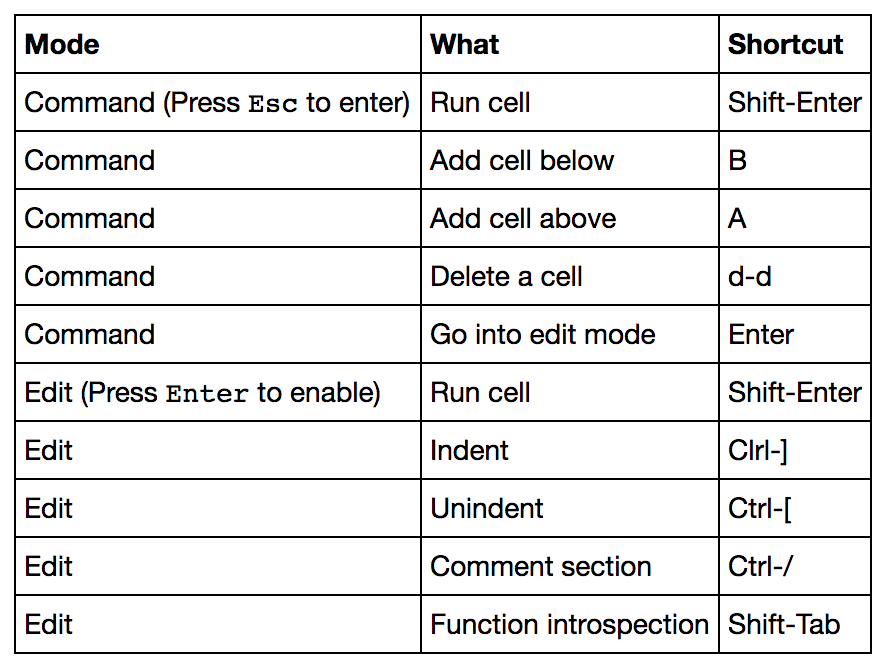

본 과정은 AI를 입문하시는 분들이 가볍과 AI기술들을 사용할 수 있는 여러 방법들을 함께 실습해 보는 시간을 가질 예정입니다. 

# 순서 

* Azure Notebook.
* Face API.
* Computer Vision API.
* Custom Vision API.
* Pandas. 
* Azure ML Studio.

## Azure Notebook. 

 Azure Notebook은 Jupyter Notebook[(http://jupyter.org/)](http://jupyter.org/)을 기반으로 만들어진 서비스 입니다. 별다른 설치 과정이 없으 웹 브라우저만 사용할 수 있는 환경이면 자유롭게 사용할 수 있는 것이 가장 큰 장점입니다. Jupyter Nootbooks를 사용해 본 사람이라면 어렵지 않게 바로 적응할 수 있습니다. 

Introduce Azure Notebook video. 

Azure Notebooks를 사용하기 위해서는 아래 링크로 접속하면 됩니다. 
[https://notebooks.azure.com/](https://notebooks.azure.com/) 

 Azure Notebooks는 설치 할 필요없이 바로 사용할 수 있으며 프로토타이핑이나 데이터사이언스 그리고 교육과 연구 목적에 빠르게 적용할 수 있습니다. 또 R과 Python을 바로 사용할 수 있습니다. 

 - 설치가 필요 없기 떄문에 빠르게 시작 할 수 있습니다. 
 - Jypter Nootbook과 사용 방법이 동일 하기 때문에 쉽습니다. 
 - R과 Python을 위한 환경을 제공합니다. 

### Azure Notebooks 메뉴 및 단축키 

### Azure Notebooks 제약사항

* You are limited to 4 Gb of memory
* You'll be signed out after 1 hour of inactivity, though your notebook is saved continuously
* Some network limitations exist. Most common sites are open, but if you experience an access denied on a web request, please request we open it by contacting us at nbhelp@microsoft.com.

